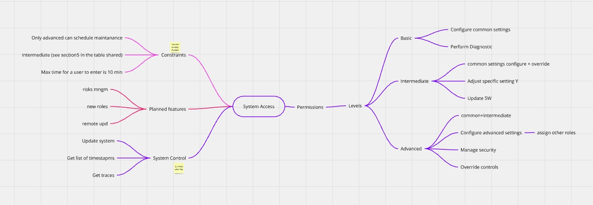

Technical writers often write about topics they don’t deeply understand. This is both a plus and a challenging curse of our job.

A plus, because it allows us to get acquainted with a multitude of new concepts, try out innovative products, and explore the tech world extensively. **Being there when new things in IT are being created** — that's what I personally love the most about tech writing.

And why the curse? It's because this approach involves a constant feeling of uncertainty and the nagging realization that "I don't understand anything at all, omg!".

You always need to ask a lot of questions, place yourself in the learner's mindset, and continuously feel the pressure to keep up and figure everything out. And deadlines often demand that you do this really quickly.

<!--truncate-->

So, here I share my tips and insights on how I gather information and organize it, so I don’t forget the details and can write documentation faster (not worrying so much about the amount of the Unknown).

## The curse of a blank page

Starting from scratch can be tough. We've all been there—staring at a blank page, feeling frustrated or overwhelmed as we try to start writing. To get myself moving, I use braindumps to jot down all the facts I have, organizing them to prepare for the next steps. This makes the process much less intimidating for me.

What do I use?

## Mindmaps to the rescue!

The main thing that helps me most these days is a **mindmap**.
A mindmap is a fantastic tool that visually organizes information.

When I listen to stakeholders or attend a knowledge-sharing meeting, I always come prepared. I bring a mindmap template with me, and each time a new idea pops up, I jot it down in my mindmap. If I don’t have enough time during the meeting, I write all my thoughts and ideas immediately afterward while they are still fresh in my memory.
The main idea here is to keep all the major details in the mindmap. This makes it easier for me to move on to the breakdown phase.

## OK, and what’s next?
After creating the mindmap, I usually analyze the results and then break this information into hierarchical chunks. It’s not always obvious how to best organize the information, but often the mindmap itself can help you with that by visually representing the topics and their connections.
At the very least, it helps structure the chaos in your head after a knowledge-sharing meeting. 😅

## What are the tools? 
Oh, there are plenty!

The one I use most is **Xmind**. Although, in most cases, there were no macros available for displaying the files in Confluence, it’s a super easy-to-use and convenient tool. I love that you can pick from a variety of preset styles whenever you like—even when you’re almost done with all the blocks. It’s like giving your work a fun makeover at the last minute.🔆

Also, **drawio** is a good choice. There are different macros available for Confluence.

**Miro** is another tool I've used a couple of times at work. It has a macro and allows easy collaboration with the team (they might have something to add to your mindmaps), and you can track all changes and history.

I’ve also tried **Figma Jamboard** a few times. It’s a nice tool, although it has some restrictions on user collaboration. But if you're using the mindmaps solely for yourself, that’s not a problem at all.

## Anyways...
You can try this out next time you have a meeting where you need to grasp a new topic for documenting. I'm sure it will be fun—at the very least, you'll have an opportunity to play around with colors and shapes. 🙃
