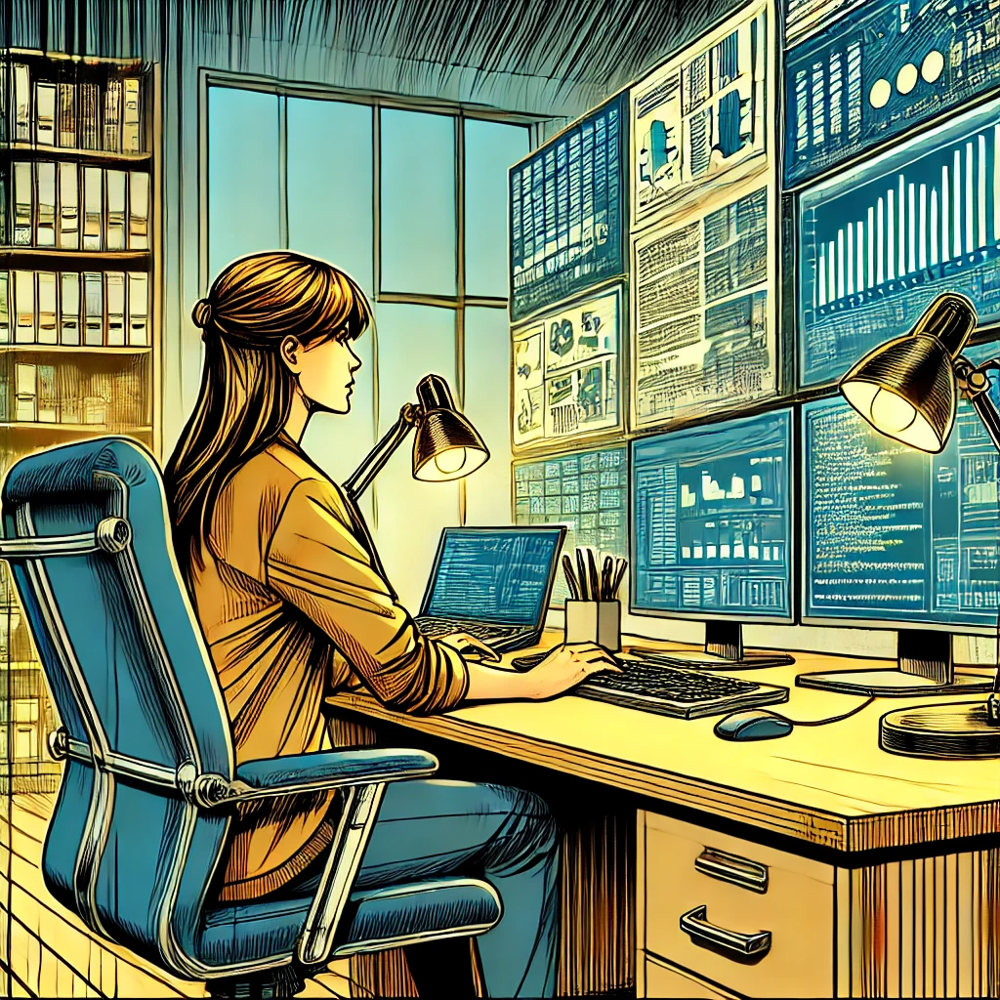
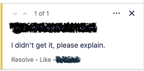

I occasionally dip my toes into the interview pool. For me, it’s like a temperature check for the industry - assessing what people are searching for, spotting the shifting tides of the market, and getting a peek into how the collective mindset around technical writing is evolving.

So, Recently, during an interview, I was hit with this question: “How can technical writers create accurate documentation if they didn’t develop the product themselves?”

This question struck a chord with me because it touches on a core aspect of our craft. But if you peel back the layers, it really asks, “What makes a great technical writer?”

With that in mind, I'd like to share some of my own insights on the topic.

<!--truncate-->

## TL;DR

It's **not** all about knowing how to code. 
While diving into programming can broaden your expertise, it can also turn into a double-edged sword. The pressure to master every line of code can lead to burnout faster than you can say “syntax error.”

What **does** make a difference is: 
- asking the right questions
- knowing the very basics
- being ready to rounds of review and corrections
- willing to orginize some mess
- knowing how to write and enjoying the process

## Knowing the basics

You don’t need to be a Java or C++ wizard to be a good tech writer. Sure, it’s a nice bonus, but it’s not the must have.

However, what is a must have (imho) is knowing the basic concepts of programming. Think of it like knowing the rules of the road even if you’re not the one driving.

- What types of architectural approaches are there?
- Which popular languages are used for which purposes?
- What are databases? Which tools for managing them are popular nowadays?
- What is UML? How do I create a diagram on my own? What tools can I use?
- What is an API? How is it used?

This is the most basic information that can help you on every project.

### Research and read

To build this foundation, you could take the scenic route with books like *"Software Architecture in Practice"* by Len Bass, Paul Clements, and Rick Kazman, or "Database Systems: The Complete Book" by Hector Garcia-Molina, Jeffrey D. Ullman, and Jennifer Widom. Or even take a course "Documenting APIs: A guide for technical writers and engineers
" by Tom Johnson.
But these days, I more up to using ChatGPT, taking Udemy courses, or reading articels on Medium. It’s all about finding what fits your style.

Leverage every resource at your disposal to know the basics. If you’re already in the trenches as a tech writer, don’t hesitate to ask your SMEs (Subject Matter Experts) for reading recommendations.  I once asked and was floored by the sheer volume of incredible suggestions that came my way.

## Ability to write and enjoying the process

I believe, this is the top skill of a good tech writer. You could be an exceptional programmer, but if you can’t clearly articulate your knowledge in writing, those skills might become more of a hindrance than a help. It’s essential to have a passion for writing, along with the ability to distill complex information into clear, concise text. Without this, the burden of knowing too much without being able to effectively communicate it can drive you up the wall.

## Askig the right questions

This is a skill that grows with you. I think, upon every other item in this list, this is one of the second most crutial for the tech writer after ability to write and passion for that.

**Your questions define the qulity of your documentation.**

There are days when I feel like a detective piecing together a complex puzzle. It starts with digging into everything I can find on the subject, then evolves into an interactive investigation during conversations with SMEs or stakeholders. I gather my questions, toss them out during discussions, and jot down every answer and idea that comes my way.  I always record or write down the answers or the related ideas.

Sometimes, after a call, I have that feeling that some parts of my puzzle are missing and I can't identify them explicitly at first glance. That’s when I turn to mind mapping [a mindmap](./2024-07-16-mindmaps/2024-07-16-long-blog-post.md) to capture all details I have to create some sort of a brain dump. Oftentimes, during this process, I can identify some of the questions that I missed, which I can then address in the next round.

Asking the right questions isn’t always easy. It's not always obvious to me what the right question is, or which information is "additional" or "extra. Sometimes I just try until I get this feeling of a "hey, this is my missing puzzle!". And when you reel in that one piece that completes the puzzle, it’s incredibly satisfying.

## Proofread and review

It might sound like a no-brainer, but sending your work out for review is essential. Getting fresh eyes on your documentation — whether from SMEs or fellow tech writers — can be interesting and useful.  You can sometimes get really surprised of how many findings, corrections, and enchansments you can get. XD

I always value feedback, even when it stings a bit. My mantra here is "it sharpens my skills and helps me grow as a professional".

And here we are, ready to **level up**.

## Becoming an advocate for documentation
This is where you elevate your role from a good technical writer to an exceptional one. I know, it's a tricky one. I’m fortunate to be in such an environment now, where ideas for improving processes and tools are always welcomed.
But there were different times...

Unfortunately, that’s not always the case. Sometimes, it feels like an uphill battle to change existing processes or shift the way coworkers perceive documentation.

Be patient, write your ideas on paper, confluence pages or whatever text editor you have in mind.
Just don't abandon them. Engage with the SMEs involved in documentation. Together, you might just spark changes that elevate the entire process, and one day, you’ll see the quality of your documentation soar.

