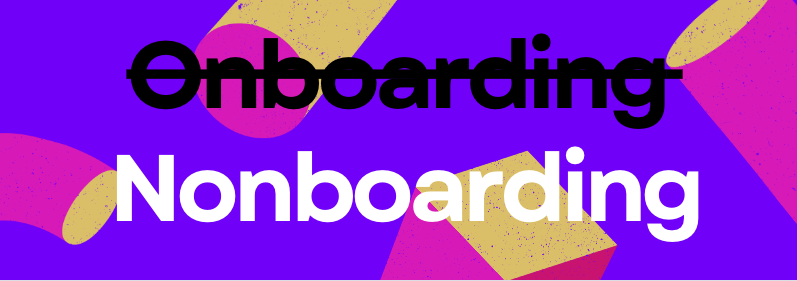

I was assigned to a new project and felt an immediate rush of excitement and pressure. It was my chance to create something truly impactful—documentation that would not only be useful but interesting.
The need for a tech writer was clear, and I was expected to set up all the processes from scratch.
I was waiting for the day 1, hoping to pop in and make it all nice and organized. 

But then, Day 1 hit me. And it hit hard…

<!--truncate-->

## Let me start from the very...end
We made it. Together with the team, we managed to set up a smooth documentation flow. We built a learning base and delivered it to the end users right on time. I received a mix of feedback, as you always do with projects like this, but hey—that's the process, right?

I did it. But at what cost?

## Nonboarding? Never heard

Months after finishing this overwhelming project, I stumbled upon the term "nonboarding" while listening to the  "Write the Docs" [techtalk](https://www.youtube.com/watch?v=m5OxGst2sks&list=PLZAeFn6dfHplddJfvbke1bpUzZGozb2Yj&index=5 "talk") by Matt Dodson.
That's was a "bingo" moment for me, when I realized, I was actually doing this the whole time, just couldn't find a good word for it.

:::note
Basically, **nonboarding** in this case means learning about the product as would a regular user do - by only reading what's available and trying the product right away. No fancy kickoff meetings, no guided tours, and definitely no onboarding documents tailored to new tech writers.
:::

Back to my Day 1: I still remember my shock when I got this message that "sorry, we still don't have onboarding materials documented, but if you have questions, feel free to ask in the chat". 😱
Uff, what a nice start of the day on a new project.

They actually had some legacy documentation, but it was random, outdated, and frankly, a mess. No one even tried to salvage it. So, my task was clear: create brand new docs from scratch with zero reliance on anything old.

Then, it all got even funnier. The team had no time explaining basic groundrules not even mentioning the specific implementation details. *I get it, guys, you had your own deadlines to meet, no worries.*  To top it off, I wasn’t invited to the tech discussions where I could have picked up useful details to document.

Still, the client was expecting the good and clear documentation.

Sound familiar? Yeah, the tech writer struggle is real.

## Read legacy docs and don't give up

So this time, I tried something, that as a result, I'll refer to as a crazy "nonboarding" thingy, to make it work.
I rolled up my sleeves and started wading through the legacy documentation that I somehow managed to get access to after multiple requests.

At first glance, it felt like trying to read an ancient script without a key. It was chaotic, disjointed, and super overwhelming. Every sentence I read felt like it raised more questions than answers. I was afraid I'll stuck in this labyrinth one day..

But I pushed through. My strategy? Write everything down. And I mean *everything*. All my thoughts, ideas, connections between bits of information scattered across different documents, questions, concerns—everything went into my notes. I even noted comments that previous team members had left, many of which seemed equally confused by the content.

Eventually, I started making sense of the chaos. As I untangled the mess, I began to understand why this documentation was failing its readers—it was confusing, fragmented, and hard to follow. So, I documented the parts that felt most confusing, figuring these were likely the same points where readers in the past had thrown in the towel (I know I wanted to more than once).

My first drafts were pure braindumps. Only I could decipher them, I guess. But I kept refining them, organizing my thoughts, and iterating until they were finally clear to be discussed with developers.

## Try it yourself or stay confused

Another key part of my nonboarding journey is that I got my hands on the product and started testing it myself.  So I started randomly testing features and seeing how everything worked (or didn’t). My hope was: "If I couldn’t get answers from documentation or the team, I’d find them by trying things myself."

That said, I realize this might not always be an option in some projects, but if you can, testing the product yourself is a game-changer.

## Interview team members

I wasn’t entirely on my own. When the developers had a moment to breathe, they were more than willing to help. After I pieced together enough information from the legacy docs and my own testing, I began bombarding the devs with specific questions.

This approach worked because I wasn’t asking vague questions like “How does X work?”—instead, I had enough context to ask about precise details: “I noticed this function does Y, but I can’t figure out how it ties to Z. Could you explain that?” I’ve learned that targeted questions are a tech writer’s best friend, and luckily, the devs were patient enough to guide me when I needed it.

Also, something that sometimes helps in interviews is assuming something, as people will often correct you. People like correcting others. I used this strategy a few times during the project.

## What's in it for you? 

If you read up to the end of this story, that's great! Now that we’ve reached the end, let's reflect on the key lessons I learned during this chaotic, yet rewarding experience.
The nonboarding
- revealed alternative ways of learning beyond traditional onboarding documents and kickoff meetings.
- improved my understanding of the main pain points that regular users, who have little prior knowledge, would encounter with the product.
- helped identify gaps in the documentation and allowed me to prioritize what needed to be addressed first.
- helped to find out more through trying the product out from day 1.

And last, but not least, not only did I survive, but I delivered the documentation on time. What good news for my CV. 🙃