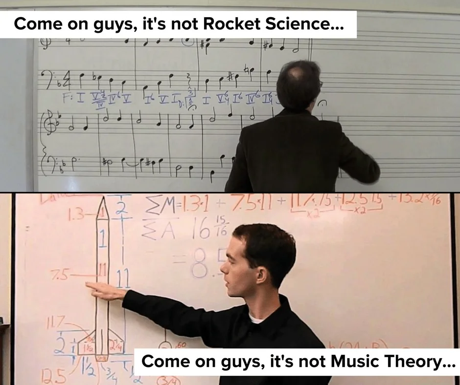
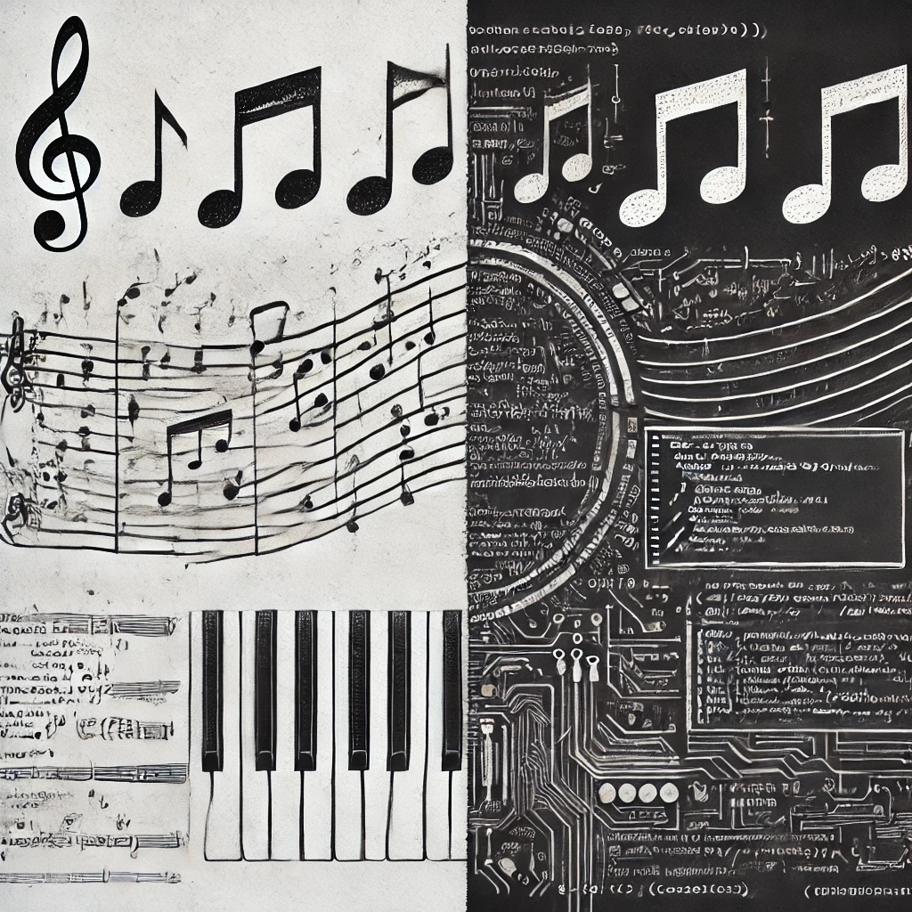
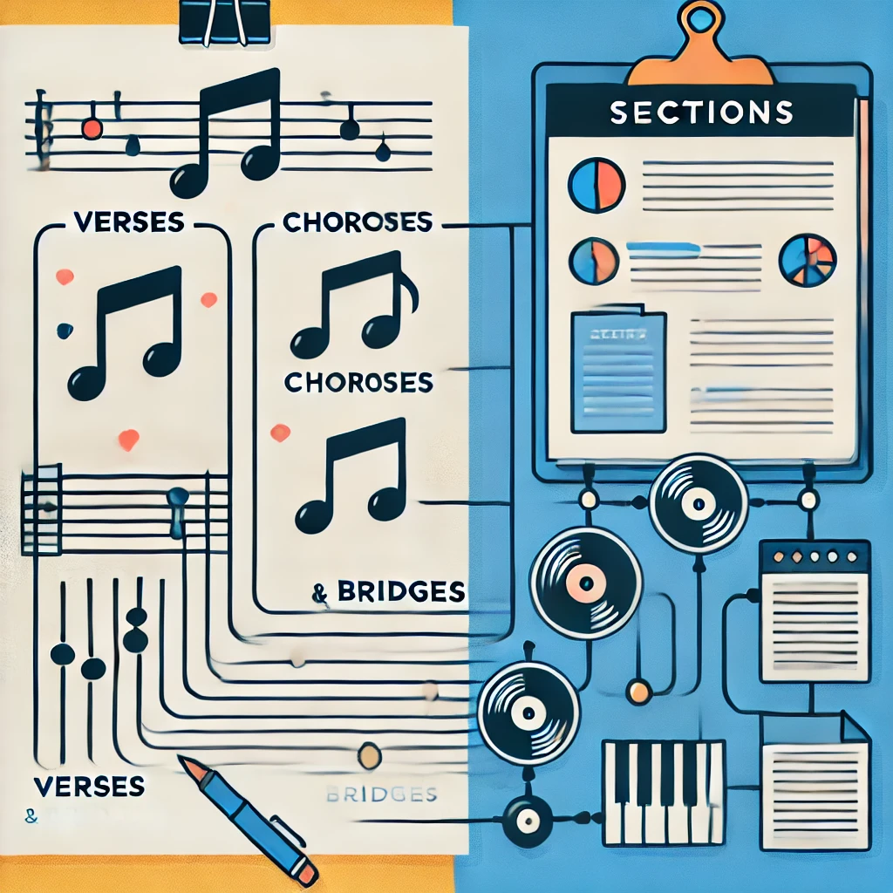

As a passionate musician, I love composing music from time to time.It's not always great, but this is what really drives my creativity and inspires my working life.

So I took a moment to reflect on how creating music is, in some cases, very much like creating tech documentation.

Got skeptical? Let me show you how these two seemingly different worlds intersect 🤗

<!--truncate-->

# Structure and composition

Think about a song—there are verses, choruses, and bridges, each with its purpose. In the same way, technical documentation follows a structured format with sections, headers, and a logical flow. You map out an outline to guide the reader, much like a composer arranges different parts of a song to take the listener on an emotional journey.

For example, in a song, the verse could be seen as the "facts" or the story you're telling, while the chorus conveys how you feel about those facts. Similarly, in tech docs, the introduction might lay out the facts, and the subsequent sections elaborate on their importance and application.

Just like musicians think through every note, tech writers carefully plan every section to build a strong foundation for the final product.

# Flow and rythm

Music isn’t just a collection of notes—it has rhythm, a pulse that drives the song forward. Similarly, a well-written document should have a smooth flow, guiding readers from one section to the next without breaking their stride.

Have you ever read something so well-written that it felt effortless to follow, even if the topic was complex? That’s what good flow in writing feels like. On the flip side, just like a song without rhythm feels chaotic, a document with clunky sentences can leave readers lost and frustrated.🙈

For instance, when you read a guide that’s overly technical and hard to understand, it’s like listening to a song with too many time changes—confusing and hard to follow.

So let’s aim for a smooth flow like your favorite song, not something overly complicated 👏

 # Iterative process

No song is perfect on the first try, and the same goes for writing. Both processes involve a lot of editing, tweaking, and refining. You might have to cut out parts that don’t work, even if you’re attached to them.

I know from personal experience that cutting a melody from a song can be painful. Maybe it makes the piece too long, or maybe it takes the focus away from the main theme. The same goes for tech docs. Sometimes you have to trim the details that bog down the clarity, even if you initially thought they were essential.

Imagine writing a user manual and including every possible detail. Sure, it's comprehensive, but if it becomes overwhelming for the reader, you might have to cut or simplify it (just like trimming that extra chord progression in your song). And this leads me to the next thought.

# Writing for audience

 I’ll sometimes have a great idea for a song that I think everyone needs to hear. But after playing it for a few friends, I realize it just doesn’t hit the way I thought it would. Maybe it’s too niche, or maybe I’m too close to the piece to see how it lands with others.

The same can happen with technical writing. You might be focused on what you think is important, but ultimately, it’s your audience that decides whether your documentation is helpful. Sometimes you’ll need to step back and rework things based on feedback, whether it’s cutting unnecessary jargon or simplifying the steps for your readers.

# Creativity within constrains

At first glance, tech writing seems pretty rigid. But within those guidelines, there’s still room for creativity. How you present the information—whether through diagrams, concise summaries, or different formatting options—can make a big difference in how easily it’s understood.

Similarly, musicians work within constraints like scales, keys, and time signatures, but the magic comes from how they bend those rules to create something unique. Writing a technical guide or composing music both require creative thinking within a set framework.

For example, if you’re writing a step-by-step guide, you might get creative by using visuals, adding FAQs, or breaking things up with bullet points to keep it digestible and engaging (just like adding a bridge to shake up the flow of a song). ✨

# Collaboration

And last but not least, it's collaboration that can create something truly worthy. When writing documentation, you might work with engineers, designers, or product managers to get all the details right. Similarly, musicians often collaborate with other band members or producers to bring a song to life.

Picture a band rehearsing together, bouncing ideas off one another. Tech writing can feel the same when you’re working closely with a team to produce a guide that helps everyone get on the same page.

And let’s be honest—collaborating can be just as fun in both cases! There’s nothing like that “aha” moment when everything clicks, whether it's the perfect harmony in a song or nailing the explanation of a tricky concept in a document.

# Bringing it all together

So there you have it — music and tech writing aren’t so different after all! Whether you're composing a melody or crafting documentation, both require structure, flow, and creativity to connect with an audience. And just like a great song, a well-written document has the power to engage, inform, and inspire.