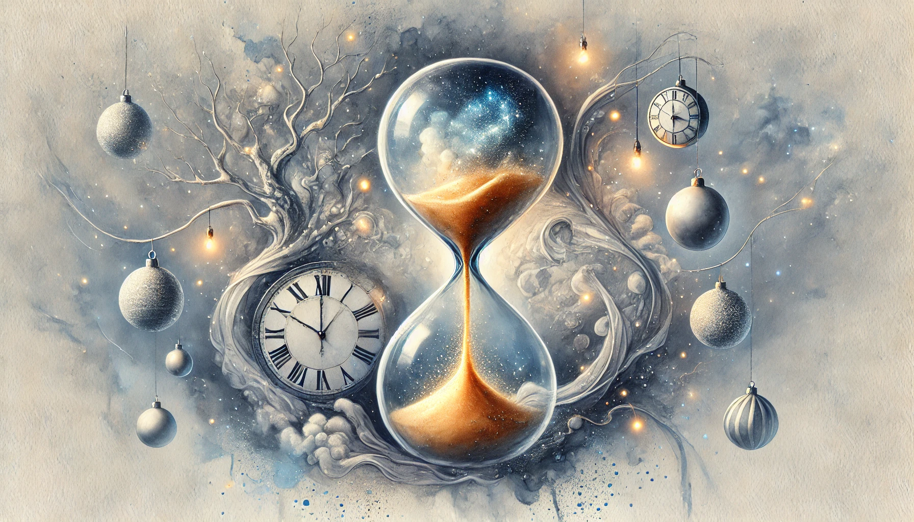
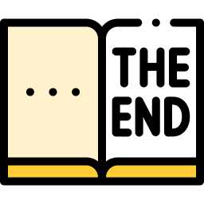

I’ve sat down to write this article so many times already.

Each time, I’d make a cup of tea, settle into my chair, and try to shape this story into something engaging. But every attempt felt... incomplete. Like something was missing. Why? Because this isn’t just a story—it’s my personal experience. And that made it hard to fully open up. I kept falling into the same trap: sharing only the polished facts and offering some reassuring summary.

But life doesn’t work like that, does it?

So, if you’re reading this, it means I finally found the courage to share what’s truly on my mind—messy, raw, and honest. These are the lessons I’ve learned this year as a professional tech writer. Maybe, just maybe, you’ll find something here that resonates with you too.

<!--truncate-->

## The context

Let me start by setting the stage.

This year has been a rollercoaster, to put it mildly. There were highs and lows, but I’ll focus on the part that shaped this story: I changed workplaces twice.

Now, switching jobs twice in one year might not sound like a big deal. For some, it’s just part of life. And, to be fair, I agree. But here’s the thing: the first time, I was forced to leave. The second time, I made the decision myself. That second change wasn’t just about leaving; it was about growth. I wanted to expand my skillset, stepping into a role that demanded more business analysis and management expertise.

Here’s another key piece of context: I live in Ukraine. The job market here has taken a severe hit because of the ongoing war. Opportunities are scarce, so every career decision feels weightier than usual.

And now, let’s dive into the lessons this year has taught me.

## Lesson 1: stability isn’t always a good thing

Stability feels good—there’s no denying that. It brings comfort and certainty, and I genuinely enjoy that sense of security.

But here’s the catch: the longer I stayed in a stable situation, the less effort I felt compelled to make toward progress. Stability can lull you into complacency. Sometimes, “bad but stable” is far worse than taking a leap into the unknown to chase your goals.

Of course, I had doubts. Big ones. Saying goodbye to something familiar is never easy. But stepping out of that comfort zone opened up so many new opportunities. And that brings me to my second lesson.

## Lesson 2: turning adversity into a catalyst for growth

I vividly remember the evening I realized I was about to lose my job. I sat there, overwhelmed by a storm of thoughts:

*"What am I going to do? Have I failed? What if I can’t find another job for months? Am I just not good enough?"*

It felt like my self-esteem plummeted straight into the Mariana Trench.

But here’s the surprising thing: those feelings, as crushing as they were, became the turning point.

After sitting in that despair for a while, a new thought emerged:
"Wait. I have freedom now. I can try anything. I can change careers, start my own business, or explore something completely new."

That realization was like a jolt of energy. Suddenly, I was motivated to push myself in ways I hadn’t considered before.

In fact, that’s what eventually led me to start writing this blog.🤗 And for that, I’m incredibly grateful.

## Lesson 3: Focus on what matters to *you*

When you’re caught up in routine, it’s easy to lose sight of your own goals. Your dreams can fade into the background, buried under the weight of day-to-day tasks.

For me, staying grounded has always meant asking “why.”

- Why am I writing this?
- What’s the purpose?
- What do I truly want to achieve in my career?
  
This year, I made space to ask myself those questions again. The answers weren’t easy to face. I realized that my work had started to feel more like a habit than a passion. My growth had stagnated.

And that’s why I chose to leave my second job. It wasn’t about running away from something—it was about moving toward something better. I’m deeply grateful for everything I learned at my previous workplace, but it’s time to explore what else I can do and what new opportunities the world has to offer.

## The conclusion

To be completely honest, there’s no clear conclusion to this story that I can offer right now. I’m still in the middle of figuring things out.

If someone were to ask me if I’d make the same choices, knowing everything this year would bring—the challenges, the uncertainty, the highs and lows—my answer would still be yes.  

I’m deeply grateful for the incredible people I’ve met along the way and the new skills I’ve gained. Each experience, even the difficult ones, has shaped me into someone stronger and more self-aware.  

I’ll admit, I’m still not entirely sure what the future holds or even exactly what I want from it. But one thing I do know with absolute clarity is what I *don’t* want: to stay stagnant, to settle for less than I’m capable of, or to let fear dictate my choices.  

And for now, that’s enough.